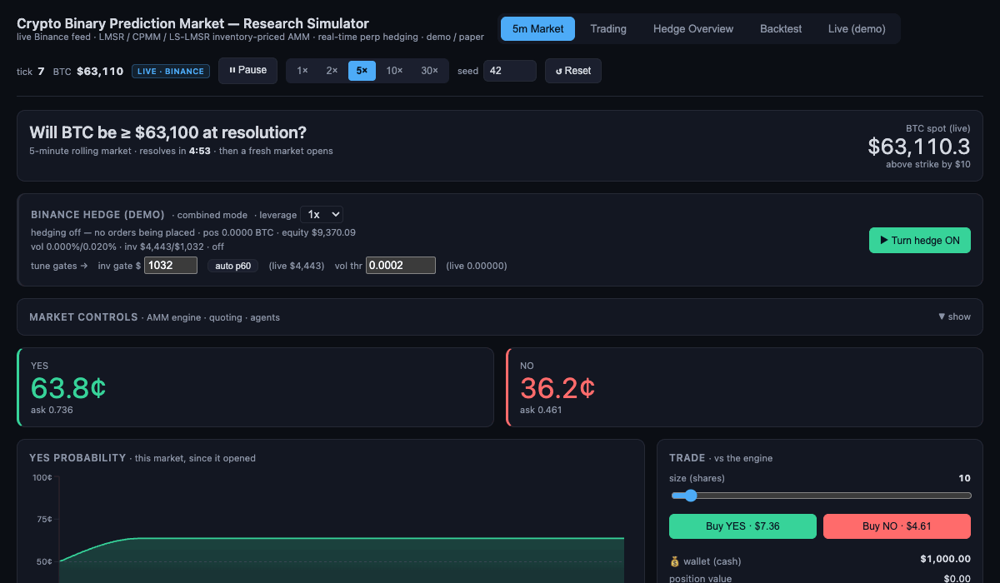
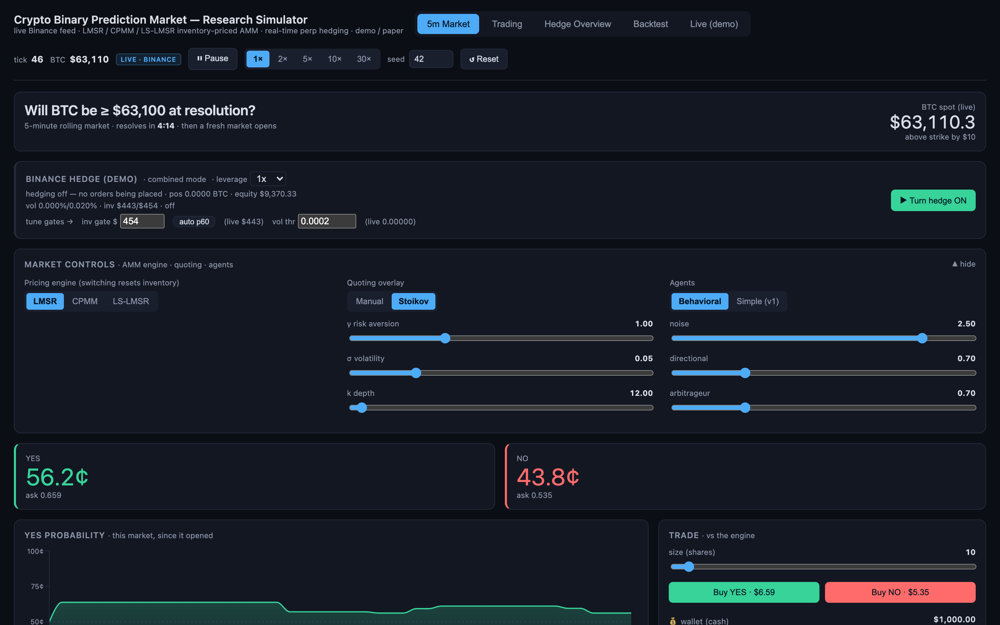
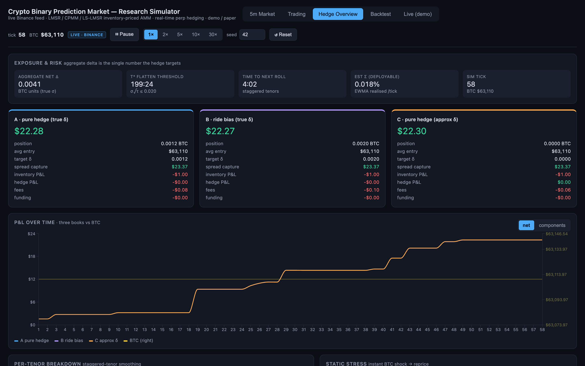
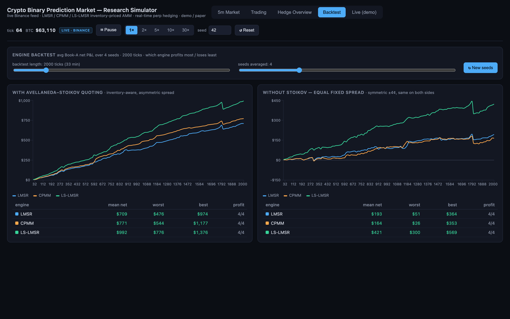
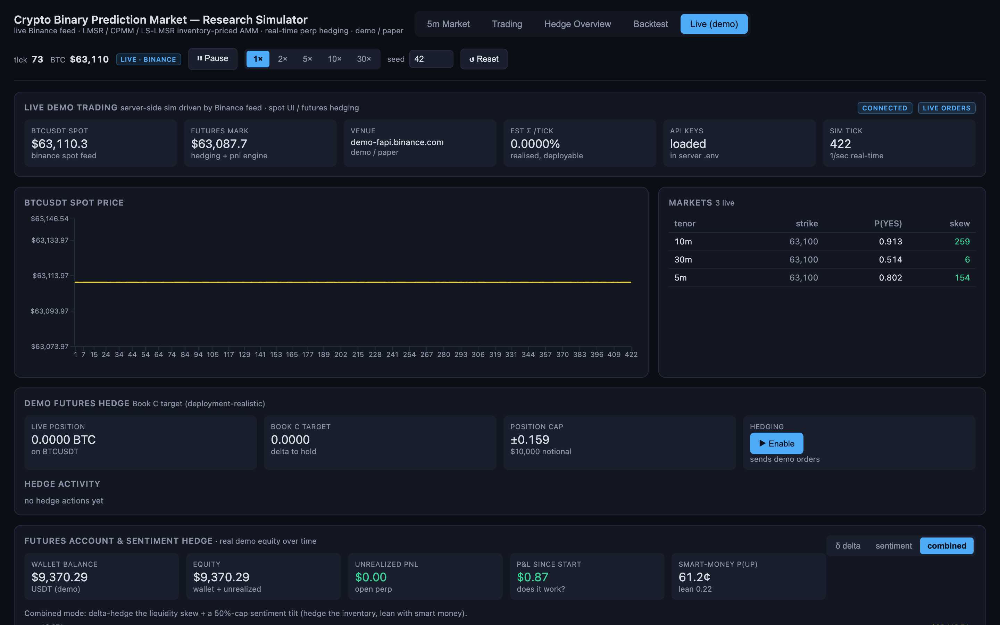

# Crypto Binary Prediction Market — Research Simulator

**Can a prediction-market maker hedge away the directional risk it is forced to carry?**

An automated market maker in binary options is a *principal*, not a broker. It
warehouses whatever inventory skew the crowd leaves behind, so its P&L is exposed
to BTC direction in a way an order-book exchange never is. This project builds
that market maker end to end — three AMM pricing engines, a quoting overlay, a
simulated trader population, and a real-time perp hedging layer wired to the live
Binance demo venue — and then measures whether hedging the skew actually pays.

**Short answer: yes, in the tails.** Delta hedging removes ~33–37% of P&L
dispersion across BTC outcomes and turns the worst case from **−$115 to +$109**.
It also costs more than it saves in calm markets. Both results are below.

### ▶ [Try the live demo →](https://sidjainnn.github.io/AMM_Hedging/)

<p align="center">
  
</p>

<p align="center"><em>A 5-minute BTC market running live: simulated traders hit the engine, the LMSR reprices off inventory, and the market rolls and settles at expiry.</em></p>

---

## The result

An AMM's inventory book is **short gamma** — it loses on big moves in *either*
direction — so a single price path can't isolate the directional risk and a
linear beta is meaningless. Instead the same order flow is replayed across a
range of BTC outcomes (−3%…+3% terminal, real intraday wiggles preserved), and
the **dispersion of final P&L** is measured. Averaged over 11 real BTC windows:

| Strategy | P&L dispersion (σ) | Worst case | Dispersion removed |
|---|---:|---:|---:|
| unhedged | $200 | **−$115** | — |
| sentiment | $156 | +$9 | 22% |
| delta | $135 | +$85 | 33% |
| **delta + sentiment tilt** | **$126** | **+$109** | **37%** |

The unhedged book's loss is concentrated exactly where it hurts — the tails.
Hedging converts a short-gamma hump into a flat, reliably positive P&L. Pure
sentiment is the weakest hedge on its own (a noisy directional proxy) but adds
edge as a *tilt* on top of delta.

**The market maker also has to survive its own liquidity subsidy.** An LMSR pays
`b·ln2` per resolved market for price discovery (~$76 at b=110); the spread has
to out-earn it. Tuning the vig, an inventory-proportional widening term, a
risk-tiered hedge dial and a per-tenor expiry lockout gets a 5-minute market to
**$77.9 mean net per window with 97% of windows break-even** (64-window A/B,
worst −$43) — up from $71.5 / 95% with the gamma-wall fix alone.

---

## What you're looking at

### The market — a live 5-minute BTC binary



A rolling "Will BTC be ≥ K at resolution?" market with an at-the-money strike,
priced by the AMM off inventory alone. The engine (LMSR / CPMM / LS-LMSR), the
quoting overlay and the agent mix are all switchable while it runs — the point is
to *see* the mechanics move, not to bury them behind knobs.

### The hedge — three books on identical flow



One market-making book, three hedge legs, so the comparison is clean:

| Book | Hedge policy | Isolates |
|---|---|---|
| **A** | full δ-neutral, *true* σ | the upper bound |
| **B** | rides part of the crowd bias (h < 1) | hedge **policy** |
| **C** | full δ-neutral, *estimated* σ | **deployment realism** |

A vs B isolates policy; A vs C isolates what you lose by not knowing σ. Only
**Book C** is actually deployable — A and B read a volatility you don't have in
production. Every number is decomposed into spread capture · inventory · hedge ·
fees · funding.

### The engine comparison — does inventory-aware quoting pay?



Same engines, same flow, quoting overlay on and off. Avellaneda–Stoikov's
inventory-aware asymmetric spread is worth **2–4× the net P&L** of a symmetric
fixed spread across all three engines (LS-LMSR $992 vs $421; LMSR $709 vs $193),
with every engine profitable in 4/4 seeds under it. LS-LMSR leads throughout.
Seeds are resampled on demand, so exact figures move run to run — the ordering
and the size of the gap do not.

### The live venue — real demo orders



The backend runs the sim off the live Binance feed and places **real orders on
the Binance demo (paper) venue**, tracking actual account equity so the concept
can be checked against real fills, fees and funding rather than a friendly
simulation. Mainnet hosts are hard-blocked in code.

---

## Try it

**Hosted demo:** [sidjainnn.github.io/AMM_Hedging](https://sidjainnn.github.io/AMM_Hedging/) —
runs entirely in the browser on a seeded synthetic price. No feed, no keys, no
orders; it's a showcase build and labels itself as one. The Backtest page is
fully live there.

**Locally, with the real Binance feed:**

```bash
npm install
npm run dev            # dashboard → http://localhost:5173
```

```bash
cd server
cp .env.example .env   # add Binance DEMO key + secret
npm install
npm start              # backend → http://localhost:8787
```

The dashboard runs without the backend, but the live-feed pages need it — the
sim deliberately **freezes rather than inventing a price** when the feed is down,
so markets can never settle on stale data. Node 18+ (developed on 22). Keys live
only in `server/.env`, which is gitignored.

---

## How it works

```
src/sim/                deterministic core (no React, no I/O)
  rng.ts                seedable mulberry32 + named sub-streams
  math.ts               log-sum-exp / softplus / normal CDF (numerically stable)
  events.ts             digital probability P(BTC(t+τ) ≥ K) and dp/dS
  engines/              LMSR · CPMM · LS-LMSR behind one interface
  quoting.ts            manual spread + Avellaneda–Stoikov overlay
  market.ts             rolling tenors, strike ladder, order book, pair-minting
  agents/               behavioral population (default) · simple v1 (rollback)
  hedging.ts            aggregate δ, σ√τ flatten rule, books A/B/C, P&L split
  breakeven.ts          64-window break-even harness
  experiment.ts         BTC-outcome stress across hedge modes
  backtest.ts           multi-seed engine comparison
src/ui/                 React dashboard (5 pages)
server/                 Node/Express: live feed, signed demo perp orders,
                        A/B window ledger → CSV
```

**The traders.** The default `behavioral` population is ~95 persistent agents
with sporadic Poisson arrivals (most ticks see no trade), heavy-tailed sizes,
patience (limit vs market), archetypes spanning noise / momentum / contrarian /
informed with a favorite-longshot bias, and **finite wallets acting as a reward
function** — agents who lose drop out, winners size up. Their skill-weighted net
positioning becomes a smart-money sentiment signal, which is what the sentiment
hedge mode trades on.

**Design rules held throughout.** The engine prices binaries from inventory `q`
only — it never anchors quotes to the feed, because anchoring replaces the AMM
mechanism with an oracle. Only trades against the engine move price; user↔user
trades pair-mint and are price-neutral. The quoting overlay changes displayed
quotes and never mutates `q`. Every input is tagged `sim-ground-truth` or
`deployment-available` so a "deployable" mechanism can't secretly read the true
volatility.

---

## What this does *not* establish

The honest limits, because they decide whether any of this survives contact with
production:

- **Calm markets lose money on hedging.** Fees and spread on each round trip
  exceed what the hedge saves when nothing moves. The hedge earns its keep in
  volatility, which is why the risk-tier dial exists.
- **The simulated hedge is too kind.** Fills happen at mark with no slippage,
  latency or market impact, so simulation *overstates* effectiveness. Only the
  demo-venue A/B ledger measures the real thing.
- **A standalone 5-minute binary is the hardest case to hedge.** Near expiry a
  digital's terminal risk is gamma, not delta: `dp/dS` diverges around the strike
  and a linear perp cannot hedge it at any size. The fix is a σ√τ flatten rule
  plus an expiry lockout — i.e. *stop* hedging — not a bigger position. Real
  value comes from hedging the aggregate across tenors.
- **Determinism ends at the feed.** The pure sim reproduces exactly from
  `config.seed`; live mode does not, and the headless tools force the synthetic
  price for that reason.

## Deeper reading

| Doc | What's in it |
|---|---|
| [`docs/experiment-results.md`](docs/experiment-results.md) | the hedging experiment: method, full sweep, findings |
| [`docs/hedging-validation-and-qa.md`](docs/hedging-validation-and-qa.md) | effectiveness verdict, break-even acceptance test, gamma wall |
| [`docs/ab-protocol.md`](docs/ab-protocol.md) | pre-registered hedged-vs-unhedged A/B: metric, exclusions, criteria |
| [`docs/engines.md`](docs/engines.md) · [`docs/quoting.md`](docs/quoting.md) · [`docs/hedging.md`](docs/hedging.md) | the maths, per layer |
| [`docs/agents.md`](docs/agents.md) · [`docs/agents-implementation.md`](docs/agents-implementation.md) | trader population and reward design |
| [`docs/decisions.md`](docs/decisions.md) | *why* each locked decision was made |
| [`docs/STATUS.md`](docs/STATUS.md) | current state and scope |

TypeScript end to end · React + Recharts · Node/Express · no real money, demo venue only.
